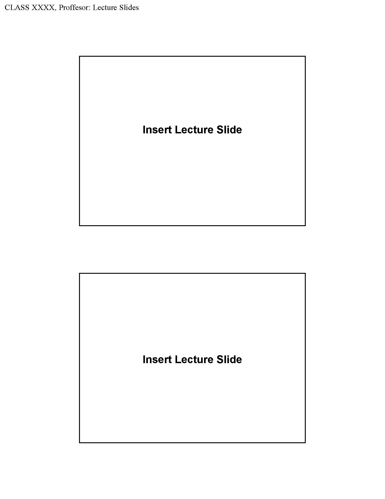
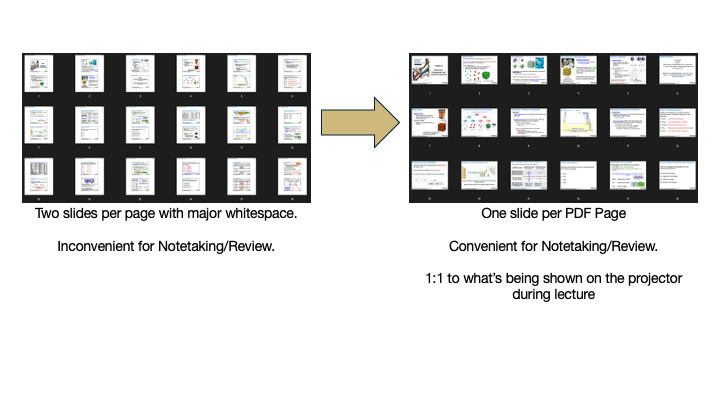

# CHEM 1113 Lecture Notes Cropper

This Python script is designed to crop specific sections of **CHEM 1113** lecture notes, tailored primarily for **Professor Broering's** slides. The script can also be applied to other PDF lecture slides that follow a similar format, making it versatile for students in the same or similar courses.

## Example Input and Output

If your lecture slides are structured similarly to the ones shown below, this script will work for you:



## How It Works

This Python script takes PDF files with slides that often contain significant whitespace and reformats them into a cleaner, one-slide-per-page format. No pixelation occurs as the script operates by cropping the PDF elements directly, maintaining the original quality.

Here’s a diagram showing how the script transforms the slides:



---

## Features

- **Optimized for Lecture Notes**: Specifically designed to process Professor Broering’s CHEM 1113 lecture notes, but may work with other PDFs that follow a similar structure.
- **Whitespace Reduction**: Transforms lecture slides with excessive whitespace into a more compact, one-slide-per-page format, preserving all original PDF elements.
- **No Pixelation**: Maintains the quality of text and diagrams by cropping the original PDF, rather than converting to images.
- **Easy to Use**: Just update the input path to your PDF file and run the script!

---

## Usage

1. **Clone the Repository**:
   ```bash
   git clone https://github.com/marredo/chem1113-lecture-cropper.git
   cd chem1113-lecture-cropper
   ```

   **OR** just download the `slideCropper.py` file by itself, install the PyMuPDF library, and use it as easily as replacing the placeholder input path.

   ```bash
   pip install pymupdf
   ```

2. **Prepare the PDF**:
   - Place the PDF lecture notes in the same directory as the script.
   - Update the script to point to your PDF file by modifying this line in `chem1113_cropper.py`:
     ```python
     input_pdf_path = "/path/to/your/Chem1113_LectureNotes.pdf"
     ```

3. **Run the Script**:
   ```bash
   python chem1113_cropper.py
   ```

4. **Output**:
   - The script will generate a new PDF with the cropped sections, prefixed with `CROPPED_`, saved in the same directory.

---

This version provides both the **repository cloning** option and the **simpler option** of just downloading the script and installing the necessary library.

Let me know if this looks good or if you need anything else adjusted!

2. **Prepare the PDF**:
   - Place the PDF lecture notes in the same directory as the script.
   - Update the script to point to your PDF file by modifying this line in `chem1113_cropper.py`:
     ```python
     input_pdf_path = "/path/to/your/Chem1113_LectureNotes.pdf"
     ```

3. **Run the Script**:
   ```bash
   python chem1113_cropper.py
   ```

4. **Output**:
   - The script will generate a new PDF with the cropped sections, prefixed with `CROPPED_`, saved in the same directory.

## Requirements

- **Python 3.x**
- **Libraries**:
   - PyMuPDF (install using `pip install pymupdf`)
